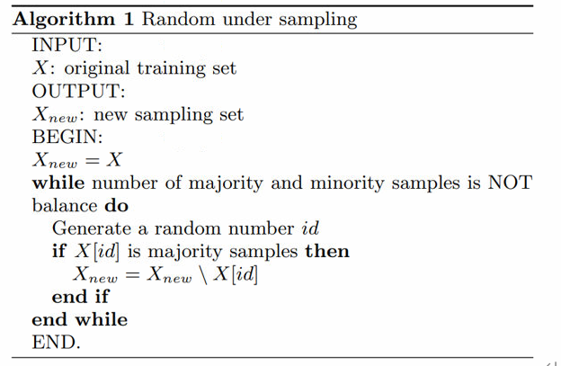

# 处理不平衡数据集的方法
---
## 重采样技术（基于数据层面）
### 1.  随机欠采样（Random Under-Sampling）
 
&emsp;&emsp;随机欠采样的目标是通过随机地消除占多数的类的样本来平衡类分布；直到多数类和少数类的实例实现平衡，目标才算达成

- 优点 
 
    ① 提升运行时间
    
    ② 当训练数据集很大时，可以通过减少样本数量来解决存储问题
-缺点
    
    ① 会丢弃对构建规则分类器很重要的有价值的潜在信息

    ② 被随机欠采样选取的样本可能具有偏差。它不能准确代表大多数。从而在实际的测试数据集上得到不精确的结果

### 2. 随机过采样（Random Over-Sampling）

&emsp;&emsp;过采样通过随机复制少数类来增加其中的实例数量，从而可增加样本中少数类的代表性

- 优点 

    ① 与欠采样不同，这种方法不会带来信息损失。

    ② 表现优于欠采样。

- 缺点

    ① 由于复制少数类事件，它加大了过拟合的可能性

### 3. 基于聚类的过采样（Cluster-Based Over Sampling）

&emsp;&emsp;K-均值聚类算法独立地被用于少数和多数类实例。这是为了识别数据集中的聚类。随后，每一个聚类都被过采样以至于相同类的所有聚类有着同样的实例数量，且所有的类有着相同的大小。

- 优点
    
    ① 这种聚类技术有助于克服类之间不平衡的挑战。表示正例的样本数量不同于表示反例的样本数量。

    ② 有助于克服由不同子聚类组成的类之间的不平衡的挑战。每一个子聚类不包含相同数量的实例

- 缺点

    ① 正如大多数过采样技术，这一算法的主要缺点是有可能过拟合训练集。

### 4. 信息性过采样：合成少数类过采样技术（SMOTE）

&emsp;&emsp;这一技术可用来避免过拟合——当直接复制少数类实例并将其添加到主数据集时。从少数类中把一个数据子集作为一个实例取走，接着创建相似的新合成的实例。这些合成的实例接着被添加进原来的数据集。新数据集被用作样本以训练分类模型。

- 优点
 
    ① 通过随机采样生成的合成样本而非实例的副本，可以缓解过拟合的问题。

    ② 不会损失有价值信息。

- 缺点 

    ① 当生成合成性实例时，SMOTE 并不会把来自其他类的相邻实例考虑进来。这导致了类重叠的增加，并会引入额外的噪音。

    ② SMOTE 对高维数据不是很有效。

### 5. 改进的合成少数类过采样技术（MSMOTE）

&emsp;&emsp;这是 SMOTE 的改进版本，SMOTE 没有考虑数据集中少数类和潜在噪声的基本分布。所以为了提高 SMOTE 的效果，MSMOTE 应运而生。

&emsp;&emsp;该算法将少数类别的样本分为 3 个不同的组：安全样本、边界样本和潜在噪声样本。分类通过计算少数类的样本和训练数据的样本之间的距离来完成。安全样本是可以提高分类器性能的那些数据点。而另一方面，噪声是可以降低分类器的性能的数据点。两者之间的那些数据点被分类为边界样本。

&emsp;&emsp;虽然 MSOMTE 的基本流程与 SMOTE 的基本流程相同，在 MSMOTE 中，选择近邻的策略不同于 SMOTE。该算法是从安全样本出发随机选择 k-最近邻的数据点，并从边界样本出发选择最近邻，并且不对潜在噪声样本进行任何操作。

### 6.SMOTE-SVM

&emsp;&emsp;在整个少样本类别中进行采样比在决策边界上生成采样不那么重要

&emsp;&emsp;这种方法使用了通过在原始训练集上训练支持向量机（SVM）分类器而获得的支持向量。通过使用基于其最近邻域中多数采样的密度的插值或外推技术，将每个少样本类别支持向量与其最近邻域进行组合，可以生成新样本。

    

### 7. modifying objective cosr function（修改目标成本函数？）

&emsp;&emsp;基于对多样本类别和少样本类别的样本进行不同的加权

&emsp;&emsp;此方法在少样本类别的样本上给出较高的分数，以便在少样本类别样本的误分类时进行更加严厉的处罚。如果该算法对少样本类别中的样本进行误分类，则会对此设置较重的惩罚。在这篇论文中，少样本类别的权重值为 $M_a \div N $ ，多样本类别的权重为 $M_i \div N $，其中 $M_a$ 和 $M_i$ 是数据集中多样本类别样本和少样本类别样本的数量，N是总样本

### 8. Condensed Nearest Neighbour

&emsp;&emsp;它可以生成原始样本集的一致子集。在该算法中，原始样本集分为S和T两类。最初，S集有一个样本是从原始集合中随机选择的，其余样本都在T集中。然后，CNN会扫描T的所有样本，如果该样本被S的内容分类错误，则会添加到S。该算法会根据需要扫描T次，直到没有样本从T转移到S。

- 缺点
    
    ① 计算量很大，因为要重复扫描T集

---
## 算法集成技术
- 修改现有的分类算法，使其适用于不平衡数据集

&emsp;&emsp;集成方法的主要目的是提高单个分类器的性能。该方法从原始数据中构建几个两级分类器，然后整合它们的预测

*由于我们的论文主要是通过生成数据集来解决数据集不平衡问题，所以这边就不展开来列举方法了*

